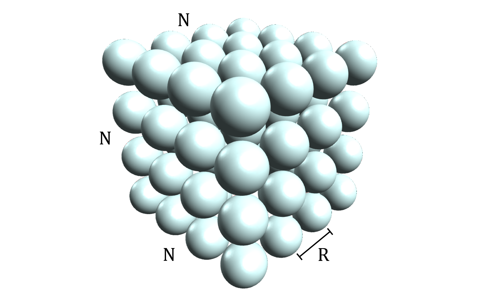

Molecular Dynamics Project

## Worth 20%, due by [10AM Friday 2nd September, 2022](https://www.timeanddate.com/countdown/generic?iso=20220902T10&p0=57&msg=COMP3320%2FCOMP6464+2022+Assignment+1+Due&ud=1&font=cursive)

The aim of the project is to develop code to run an elementary molecular dynamics (MD) simulation. MD simulations are widely used in computational chemistry, physics, biology, material science etc. It was also one of the first scientific uses of computers going back to work by Alder and Wainwright who, in 1957, simulated the motion of about 150 argon atoms. (See [Alder, B. J. and Wainwright, T. E. J. Chem. Phys. 27, 1208 (1957)](https://doi.org/10.1063/1.1743957) and [J. Chem. Phys. 31, 459 (1959)](https://doi.org/10.1063/1.1730376))

In MD, each atom is represented as a point in space. The atoms interact with each other via pairwise potentials, in a similar manner to the way gravity interacts between the planets, sun, moons and stars. In practice this is just an approximation since quantum effects are often important - but we'll ignore this and confine our discussions to "classical" MD.

To calculate the potential energy between two atoms $`i`$ and $`j`$, we will use a [Lennard-Jones potential energy](https://chem.libretexts.org/Bookshelves/Physical_and_Theoretical_Chemistry_Textbook_Maps/Supplemental_Modules_(Physical_and_Theoretical_Chemistry)/Physical_Properties_of_Matter/Atomic_and_Molecular_Properties/Intermolecular_Forces/Specific_Interactions/Lennard-Jones_Potential) function of the form

```math
V_{ij} = \frac{1}{(r_{ij})^{12}}-\frac{2}{(r_{ij})^6}
```

where $`r_{ij}`$ is the distance between the two atoms. [*Note: For simplicity we here choose the Lennard-Jones interaction parameters $`A = 1`$ and $`B = 2`$*]. To evaluate the interaction for many bodies we must simply perform a sum over all unique two body interactions. For example, for 3 particles we will have interactions 1-2, 1-3 and 2-3.

In this program we will start with a grid of stationary atoms arranged in a cubic box with `N` atoms along each side, such that there are a total of $`N^3`$ atoms as shown in the following figure, with adjacent atoms separated by a distance `R`.



### Getting Started

To get started working on this assignment, fork this repository and then clone your copy of the repository (with url `https://gitlab.cecs.anu.edu.au/<YOUR_UID>/comp3320-2022-assignment-1`) to a folder on Gadi, just as you did with the labs.

#### Navigating the Repo

You will notice that the repository already contains a number of files with template code that has been written for you. It is not a requirement that you keep or use any of this code, but it is there to help structure your program and the general usage of the program must remain the same. Here is a brief overview of the files in this repo:

- [`img/`](img) - this folder contains the images used in this document.
- [`lib/`](lib) - this folder contains some useful library code and classes for the python program. You should be able to complete the assignment without modifying these files, however you may want to look at them to understand how they work and to be able to modify them if you wish.
    - [`argument_parser.py`](lib/argument_parser.py) - Reads in the arguments for [md.py](md.py).
    - [`c_structures.py`](lib/c_structures.py) - Defines C data structures for the python/C interface.
    - [`utils.py`](lib/utils.py) - Defines a 3D vector class and an Atom class.
    - [`visual_atom.py`](lib/visual_atom.py) - Defines an Atom subclass which provides visualization.
- [`.gitignore`](.gitignore) - this file tells git which files it can safely ignore, such as your compiled executables.
- [`Makefile`](Makefile) - this file is used to compile the C code.
- [`README.md`](README.md) - these instructions!
- [`Report.pdf`](Report.pdf) - you should replace this pdf with your report to complete [Step 3](#step-3) below.
- [`WRITEUP.txt`](WRITEUP.txt) - you should fill out this file with details of how long you spent on each component of the assignment, any notable deficiencies in your work and detail any collaboration.
- [`md.py`](md.py) - this is the main python program which you must complete in [Step 1](#step-1) and provides a visualization of your simulation for use in debugging if you wish.
- [`md_AoS.c`](md_AoS.c) - this is a C version of [`md.py`](md.py) for use with the AoS code written in [Step 2](#step-2) without visualization. This may be useful for making performance measurements of your code.
- [`md_SoA.c`](md_SoA.c) - this is a C version of [`md.py`](md.py) for use with the SoA code written in [Step 2](#step-2) without visualization. This may be useful for making performance measurements of your code.
- [`md_lib_AoS.c`](md_lib_AoS.c) - this contains the C code with an AoS data structure that you will write in [Step 2](#step-2) that is called by both [`md.py`](md.py) and [`md_AoS.c`](md_AoS.c).
- [`md_lib_SoA.c`](md_lib_SoA.c) - this contains the C code with an SoA data structure that you will write in [Step 2](#step-2) that is called by both [`md.py`](md.py) and [`md_SoA.c`](md_SoA.c).
- [`sample_outputs.md`](sample_outputs.md) - this provide some sample outputs that your code should produce to check you are on the right track.
- [`auto_test.py`](auto_test.py) - this is a test script to help you make sure that your code will pass the auto marker.

The main program has 4 positional arguments

1. $`N`$ - number of atoms in each dimension of the box,
2. $`R`$ - the spacing between adjacent atoms in the grid,
3. $`dt`$ - the time step, and
4. $`iter`$ - the number of time steps in your simulation.

There are also two optional arguments provided with the `-v` and `-c` flags respectively. The `-v` flag enables the visualization (this will not work on Gadi) and the `-c` flag followed by an additional parameter instructs the program to use one of your C implementations for the compute intensive portions of the program rather than the python code. For example `-c AoS` instructs the program to outsource the compute-intensive functions to the code in `md_lib_AoS.c` (provided it has been compiled to `md_lib_AoS.so` via the `make` command).

The python program input is as follows: `python3 md.py N R dt iter [-v] [-c {AoS, SoA, Opt}]`. You can obtain this information by running `python3 md.py --help`.

You are also provided with two C programs (`md_AoS` and `md_SoA`) to help measure the performance of your C code which you will write in [`Step 2`](#step-2)). These can be run with `./md_AoS N R dt iter` and `./md_SoA N R dt iter` respectively. You can compile all of the C code by running the command `make`.

#### Running the code on Gadi

To run the python code on Gadi, you will first need to load the python3/3.8.5 module by running the command

```bash
module load python3/3.8.5
```

You can then check that everything is working by running the command `python3 md.py 1 1 0.001 1` which should give the output

```
Initial grid spacing  : 1.000000
Total number of atoms : 1
Integration time step : 0.001000
Number of timesteps   : 1
TIME      Total          Kinetic        Potential
-----------------------------------------------------
0.000000  0.000000e+00   0.000000e+00   0.000000e+00
```

The C code can be run as usual without loading additional modules.

#### Running the code with visualization

You can also clone your copy of the repository to your own machine which will allow you to view a 3D visualization of the simulation in your browser. This is ***NOT*** a requirement to complete the assignment and we will not test the visualization when marking, it is only provided to assist in debugging your program (and it is cool to watch your simulation in real time!).

To run the visualization, you will first need to install [Python 3](https://www.python.org/downloads/) on your machine if you have not done so already. We recommend Python 3.8.5 as this is what we will use to test your program, however any version of python 3.5 or later will be okay. You can check that you have Python 3 installed by opening a terminal and entering

```bash
python3 --version
```

You will also need to install [`vpython` (Visual Python)](https://www.vpython.org/) which is the library used to create a 3D interactive visualization of your simulation. You can install `vpython` by running the commands

```bash
python3 -m pip install --upgrade pip
python3 -m pip install vpython
```

After installing `vpython`, you can then test that the visualization is working by running

```bash
python3 md.py 3 1 0.001 1 -v
```

Which should open a tab in your browser showing all the atoms neatly arranged in a $`3\times3\times3`$ cube. To end the simulation on a Linux or Mac computer, simply press `Ctrl + Z` in your terminal. On a windows machine, you may need to refresh the page in your browser instead to terminate the program.

## STEP 1:

Simulating MD requires solving a set of differential equations relating the position, velocity and acceleration of the atoms. Let us first consider the pairwise force between two atoms due to their pairwise potential which defines the acceleration of each atom. The force on atom $`i`$ with coordinates $`\boldsymbol{r_i}=(x_i, y_i, z_i)`$ due to atom $`j`$ with coordinates $`\boldsymbol{r_j}=(x_j, y_j, z_j)`$ is equal to the negative derivative of the potential energy with respect to $`\boldsymbol{r_i}`$ (i.e.
$`\boldsymbol{F}=-\nabla V_{ij} = -\left(\frac{\partial V_{ij}}{\partial x_i}, \frac{\partial V_{ij}}{\partial y_i}, \frac{\partial V_{ij}}{\partial z_i}\right)`$), or

```math
F_x = \left(\frac{12}{(r_{ij})^{14}} - \frac{12}{(r_{ij})^8}\right)(x_i-x_j)
```
```math
F_y = \left(\frac{12}{(r_{ij})^{14}} - \frac{12}{(r_{ij})^8}\right)(y_i-y_j)
```
```math
F_z = \left(\frac{12}{(r_{ij})^{14}} - \frac{12}{(r_{ij})^8}\right)(z_i-z_j)
```

By assuming that all particles have unit mass we can replace the acceleration by the force ($`F = ma`$). The total force on a given atom will be the sum of all the pairwise forces.

We can now simulate the system by using these forces to update the position and velocity of the atoms over time. There are a variety of ways in which we can do this, but a popular method is the so called ["velocity verlet" algorithm](https://en.wikipedia.org/wiki/Verlet_integration#Velocity_Verlet). This has the following form

```math
position(t+dt) = position(t) + dt * \left(velocity(t) + \frac{dt*acceleration(t)}{2}\right)
```
```math
velocity(t+dt) = velocity(t) + dt * \frac{acceleration(t) + acceleration(t+dt)}{2}
```

where $`t`$ is the current time, and $`dt`$ is the timestep (the integration step). Remember the initial velocity of the atoms at time $`t=0`$ is zero so to update the positions at the first timestep you must just calculate the forces. [*For the computationally simpler, but mathematically equivalent “leap frog” scheme, see the lecture notes! Note that you may wish to change some of the template code if using the leap frog method.*].

When the particles begin to move they will gain kinetic energy ($`KE = \frac{1}{2}mv^2`$) with the total KE just a simple sum of all the atomic KEs. If there is no source or sink of energy then the total energy ($`PE+KE`$) should remain constant, so the gain in KE is offset by a loss of PE. Extend the provided Python code in [md.py](md.py) to compute the force on each atom and allow the particles to move by completing the functions `initial_config` and `update_timestep`.

If you don't know much about Python, you can check out [this tutorial](https://www.learnpython.org/) for a quick introduction.

In [sample_output.md](sample_output.md) there is some sample output for you to verify that your results are correct. *This section is only worth **2 marks**, so once you have something working make sure you get started on the steps below*

***You should aim to have this working by the assignment lab in week 4.***

## STEP 2:

Re-write the compute intensive parts of your Python code in C using the two interfaces provided (or modify them as you wish), once using an array of structs (AoS) layout in `md_lib_AoS.c` and once using a struct of arrays (SoA) layout in `md_lib_SoA.c` to store the atom data. A wikipedia article comparing these two layouts can be seen [here](https://en.wikipedia.org/wiki/AoS_and_SoA).

The provided python code and the code in `md_SoA.c`/`md_AoS.c` will read in the various parameters, form a grid of atoms and then start by calling the C function

```C
void initial_config(double dt, Atoms *atoms, double *potential_energy)
```

This should perform any initial calculations and return the starting potential energy of the system at the location referenced by the pointer `potential_energy`.

The python code will then perform $`iter-1`$ iterations calling the function

```C
void update_timestep(double dt, Atoms *atoms, double *kinetic_energy, double *potential_energy)
```

which should update all of the atoms by a single timestep and return both the potential energy and the kinetic energy of the system at the end of the timestep at the locations referenced by the pointers `potential_energy` and `kinetic_energy` respectively.

After completing this step, you should have two working C implementations that can be run with any of the following commands

```bash
python3 md.py N R dt iter -c AoS
python3 md.py N R dt iter -c SoA
./md_AoS N R dt iter
./md_SoA N R dt iter
```

## STEP 3:

In this step, you are required to analyse the accuracy and performance of your C code. You must write a short report (at most 2000 words) titled [Report.pdf](Report.pdf) (replace the blank file in this repository) which addresses the questions below. The report should be formatted with a separate heading clearly identifying each question (this is not included in the word count). You *will* lose marks for a poorly structured report. You are encouraged to use the tools introduced to you during the labs and lectures to help answer these questions - you should present your results using tables, graphs, and diagrams when appropriate. Unless mentioned otherwise, you should gather your performance results on Gadi and provide sufficient details to allow the marker to reproduce your results.

For questions 1-4, pick ***either*** your AoS or SoA code (make sure you specify which) to perform and present the analysis - you do not have to answer these questions for both programs.

1. Assuming that the total energy before the first iteration is exact, present an analysis of numerical errors due to the following factors:

    1. increasing number of atoms,
    2. increasing number of iterations, and
    3. increasing timestep size.

    For each of these factors, identify and discuss the most likely source of numerical errors. ***(4 marks)***

2. What is the overall execution time of your code as a function of different problem dimensions? Provide a detailed analysis of how your code scales with respect to the input parameters $`N`$, $`R`$, $`dt`$, and $`iter`$ (e.g. is it $`O(N \log N)`$,$`O(N)`$?) ***(4 marks)***

3. During each iteration, what proportion of the total execution time is spent calculating the new i) positions, ii) forces, and iii) velocities? How does this proportion change as problem dimension increases and how did you determine your answer? ***(3 marks)***

4. Does the most computationally intensive component correspond to the lines of code that is executed most often? How did you determine this? ***(3 marks)***

5.  Compare your struct of arrays (SoA) code with your array of structs (AoS) code. Which do you expect to perform better? Which actually performs better or do they perform the same? Explain *why* you think this might be the case. What aspects of your CPU hardware would change which data structure layout is preferable? ***(4 marks)***

6. Show some data obtained using hardware performance counters comparing your SoA and AoS code. This may include metrics such as cycle counts, L1/L2 cache miss rates, instructions per cycle, branch mispredictions, or whatever appears worthwhile to you. Explain the significance of each metric that you have chosen, analyse how they vary with different problem dimensions, and discuss how they correlate with observed execution times (if applicable). Does this explain the performance difference (if any) between your two codes? [*You must do this on Gadi*] ***(5 marks)***

7. Choose either your SoA or AoS code and create a new program `md_Opt` by copying the files `md_XoX.c`->`md_Opt.c` and `md_lib_XoX.c`->`md_lib_Opt.c` respectively. Modify the `md_Opt.c`, `md_lib_Opt.c`, `Makefile`, and `md.py` files accordingly so that you can run the new code with either `./md_Opt N R dt iter` or `python3 md.py N R dt iter -c Opt`. Develop a modification to this code (e.g. change the access pattern, code structure or add an additional optimization) and compare the performance with the previous version using the tools you have been introduced to during the labs and lectures. ***(5 marks)***

To complete this step, we envisage that you will need to modify the C code and potentially its Makefile substantially (ie. add calls to timers and performance counters, change compiler flags to enable gprof, etc). You must ensure that you provide sufficient details in your report so that we can easily reproduce the performance results that you reported **WITHOUT** having to modify your code or Makefile. Marks will be deducted if this requirement is not met.

---

#### **For COMP6464 and Honours Students Only (8-12):**

8. Suppose now you want to convert your optimized molecular dynamics (`md_Opt`) code into a *benchmark* similar to the LINPACK benchmarks. Research and briefly describe the implementation of the LINPACK benchmark, and how the TOP500 list is compiled using LINPACK. ***(1 mark)***

9. Considering how LINPACK calculates the number of floating point operations (FLOP) as a model, devise a method for measuring the MFLOP/s in relation to your MD code. Specifically, outline how you will calculate the number of FLOPs for a given problem dimension. ***(2 marks)***

10. Using your method for calculating MFLOP/s, determine the values of $`N_{max}`$, and $`R_{max}`$ for your MD code on Gadi and on your personal machine or a desktop PC in the computer labs. Discuss why the particular dimension $`N_{max}`$ yielded the best performance. ***(4 marks)***

11. What is the theoretical peak MFLOP/s ($`R_{peak}`$) of Gadi? Discuss how this compares with the actual maximum MFLOP/s ($`R_{max}`$)? ***(1 mark)***

12. What aspects of the computational architecture does your benchmark assess? What aspects does it not assess? (For example the STREAM benchmark is designed to assess memory bandwidth, but not cache performance) ***(2 marks)***

---

## Formatting of your program

All your submitted code should include this header at the top:

```
Name:
Student Number:
Course: COMP3320
Assignment Number: 1
Name of this file:
I declare that the material I am submitting in this file is entirely my own work. I have not collaborated with anyone to produce it, nor have I copied it, in part or in full, from work produced by someone else. I have not given access to this material to any other student in this course.
```

I must be able to run your code from the command line by typing `python md.py N R dt iter` as explained above. Your code should output to `stdout` the total energy, potential energy, and kinetic energy at every timestep as provided in the template. You *will* lose marks if you change the structure of the template or commands to run the programs as a portion of your correctness and performance mark will be auto graded. You can test that your code will work with the auto grader by running the provided test script using `python3 auto_test.py` on Gadi. Your code will be timed and tested on additional inputs, however this script will give a good indication of how you are going.

## Submission and Assessment:

You are required to submit a single zipped file using Wattle (see week 7 Project 1 SUBMISSION) before 10:00am on Friday September 3rd. Name the zip file `comp3320-2022-assignment-1.zip`. This zip file can be generated using the command `zip comp3320-2022-assignment-1.zip ../comp3320-2022-assignment-1/ -r -x *.git* *__pycache__*` on a linux machine (such as Gadi) from the root folder of the repo.

The zip file should expand to give the root directory of this repository that contains
- Your [Report.pdf](Report.pdf) (this ***must*** be in pdf format)
- All source code (ensure that it is all compiled by running just the command `make`)
- a plain text file called [WRITEUP.txt](WRITEUP.txt) that details how long it took you to complete each part of the project and details of who you collaborated with (if anyone)

***Your code will be tested on Gadi - so make sure it works on this system. The `auto_test.py` script has been included to help you with this. You can use anything you find generally available (not something you installed in your directory) on Gadi (including libraries).***

Your assignment will be marked out of 40 for COMP3320 students, and out of 50 for COMP6464 students. This is worth 20% of your total overall course score. The programming marks will be distributed as follows:

- Correctness of your python code in calculating energy values, forces, velocities ***(2 marks)***
- Correctness and performance of your C code in calculating energy values, forces, velocities ***(8 marks)***
- Coding style and commenting ***(2 marks)***

The distribution of marks for the report is given above (***28 marks COMP3320, 38 marks COMP6464***)
